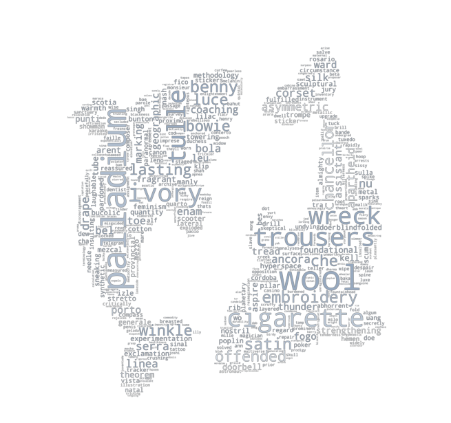

# **What can we learn from social media?**
  
Living in a decade in which technology gained the power, social media started to play a major role in every people's life. Facebook, Instagram or Twitter are just few of the names of the platforms that have a daily increase in the number of the new accouns created. This highlights the fact that people feel more and more the need to share different aspects of their lifes either by simply sharing a photo or thier personal opinions related to a topic. With this idea in mind, we decided to work with the most followed **[Twitter](https://twitter.com)** accounts of famous people. As a brief overview of the last statistics, there are 340 million accounts on Twitter from which 186 million are daily active. When it comes to how many tweets are sent per day, the number is around 500 million.  

With a little help from the Twitter API, the most followed accounts of famous people together with their handle, number of following accounts, and their last 50 Tweets from the past week (16/11/2020 - 20/11/2020) were been collected. Wikipedia API was also used to extract the birthday of those famous people. These actions have been done to be able to determine the **[zodiac sign](https://askastrology.com/zodiac-signs/)** of every person and also establish to which **[element](https://astrostyle.com/learn-astrology/the-elements-fire-earth-air-and-water-signs/)** does that sign belongs. This information is compressed in a ??MB csv file. For more detailed information, please visit the Explainer Notebook. 

 
 
{:height="250px" width="250px"}
 
 

