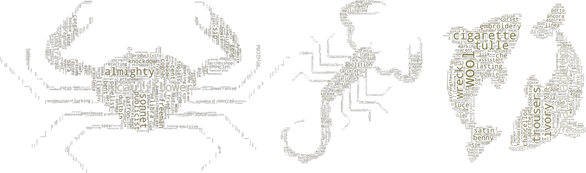
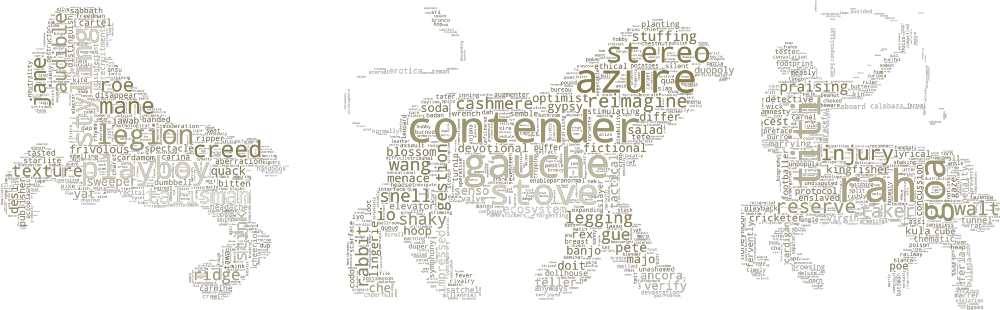
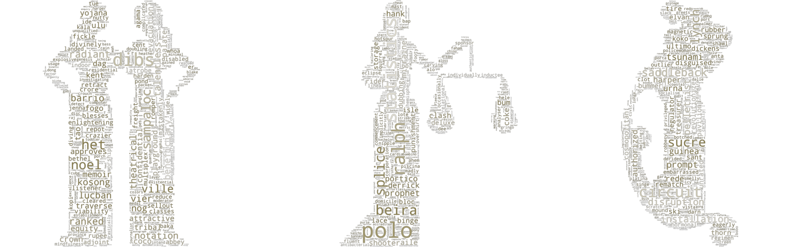

# **What can we learn from social media?**
  
Living in a decade in which technology gained the power, social media started to play a major role in every people's life. Facebook, Instagram or Twitter are just few of the names of the platforms that have a daily increase in the number of the new accouns created. This highlights the fact that people feel more and more the need to share different aspects of their lifes either by simply sharing a photo or thier personal opinions related to a topic. With this idea in mind, we decided to work with the most followed **[Twitter](https://twitter.com)** accounts of famous people. As a brief overview of the last statistics, there are 340 million accounts on Twitter from which 186 million are daily active. When it comes to how many tweets are sent per day, the number is around 500 million.  

With a little help from the Twitter API, the most followed accounts of famous people together with their handle, number of following accounts, and their last 50 Tweets from the past week (16/11/2020 - 20/11/2020) were been collected. Wikipedia API was also used to extract the birthday of those famous people. These actions have been done to be able to determine the **[zodiac sign](https://askastrology.com/zodiac-signs/)** of every person and also establish to which **[element](https://astrostyle.com/learn-astrology/the-elements-fire-earth-air-and-water-signs/)** does that sign belongs. This information is compressed in a 82.23MB pickle file. For more detailed information, please visit the Explainer Notebook. 

# **How does the network looks like?**

Before starting analysing  
The data that was gathered was first used to plot the network to have a quick overview on the connections. 
This network has a total of 2037 nodes and 124721 links. Each node is represented by a personality's zodiac sign and each link represents how they are connected.  

  

At a first look, this representation does not provide many information. Many people might ask: good, but what does this mean? However, if the focus is moved to the in-out degree it can be easily seen that when it comes to the out degree so 

  

# **Content analysis**

When it comes to the language used, in the social media area it is very personal. This is because when someone writes on the internet, that person is actually stating his opinion. Taking into consideration the astology factor, it is already known that some zodiac signs tend to be more sensible, other ones more harsh and others do not even want to share what they truly think with other people. 
 

# **Communities**

  

  

  

# **Sentiment of the communities**

  

  

  

